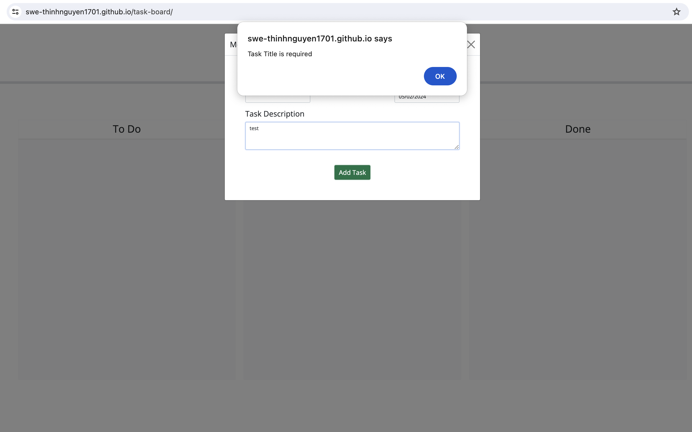
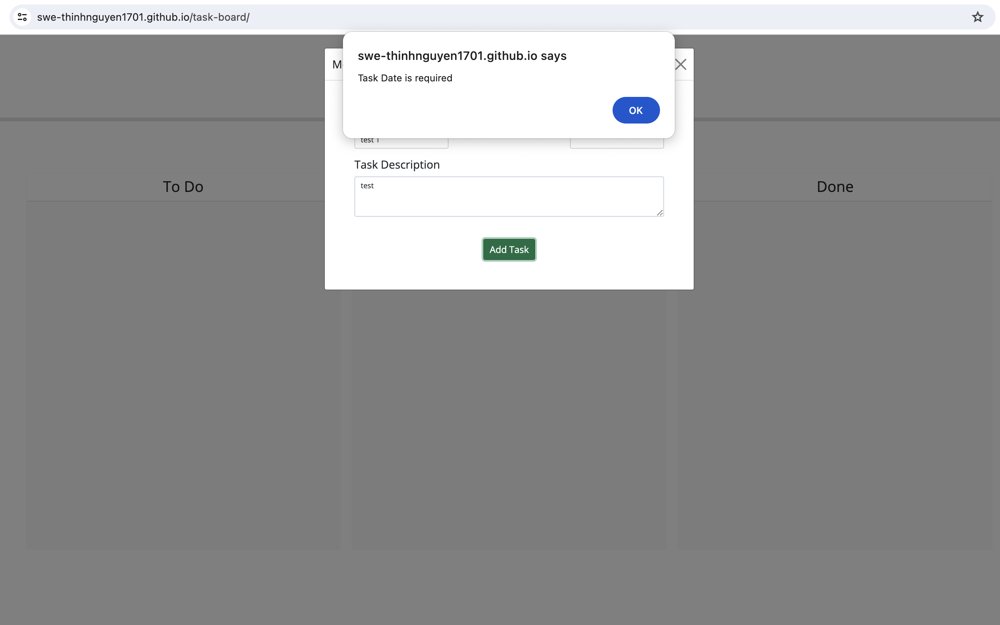
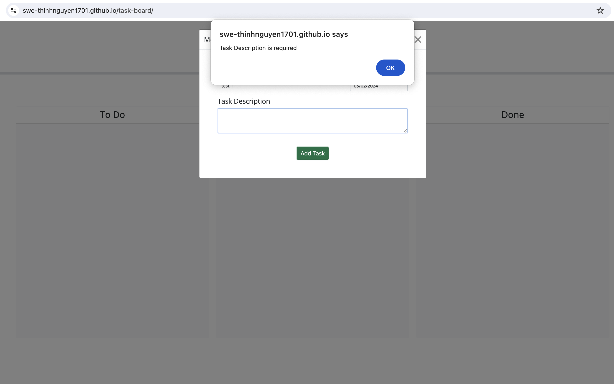
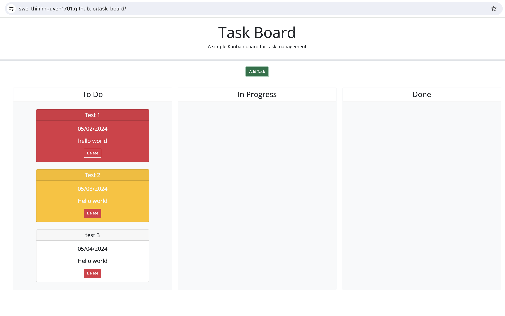
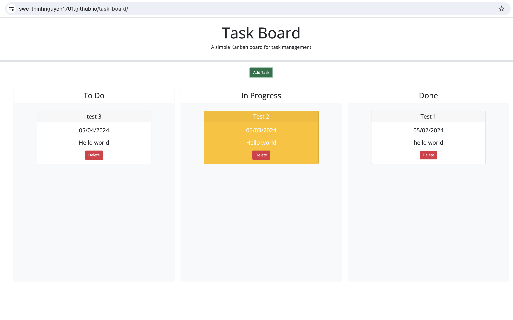

# 05 Third-Party APIs: Task Board

## Achievement
Task Board helps users to identify the status of tasks
1. if a task is overdue, then its background color is red.
2. if a task is due in 24 hours, then its background color is yellow.
3. otherwise, its background color is white.

All tasks that users insert will be store in local storage, so that they can review their tasks whenever they visit the site.
Explore Task Board at: https://swe-thinhnguyen1701.github.io/task-board/

## Handle Exception

```
WHEN user enter nothing or only space
THEN system will pop up an error message to let user know which field should be filled.
```

Figure 1.1: System complains when users enter nothing or space only in the title field.


Figure 1.2: System System complains when users enter does not select due date.


Figure 1.3: System System complains when enter nothing or space only in the task description field.

## Valid Input
```
WHEN users enter valid input.
THEN the system will display a task on browser and set up the background color based on the due date.
```


```
WHEN users move a task to the DONE status area.
THEN the system will change a background color back to default.
```
